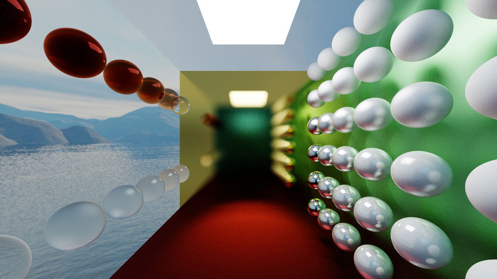
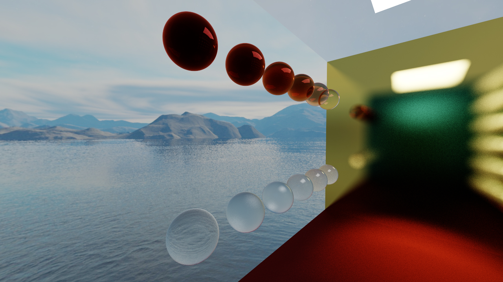

# GLSL Path Tracing

This sample is a real-time path tracer written using C++ and OpenGL 4.6. The objects in the scene are initialized on the CPU
before being uploaded to the GPU via an SSBO (Shader Storage Buffer Object). The scene is processed by a path tracing shader
program, found in `assets/shaders/path_tracing.frag`. This shader shoots rays through each pixel of the output image and tests 
the scene geometry for intersections. Upon intersecting with an object, radiance contributions and additional ray bounces are
computed based on the properties of the material of the intersected object, which can be found in `include/material.h`. If the 
ray does not intersect with an object, the contributing radiance is queried from the scene skybox, the textures for which can
be found in `assets/textures/skybox`. 

The scene gets rendered to a separate FBO (Framebuffer Object) to allow for various rendering effects such as de-noising of
the path tracing output, HDR (High Dynamic Range) post-processing, and modeling camera exposure. With the exception of de-noising,
which is done by interpolating between the output of the previous frame and the current frame, these effects can be found in
the post-processing shader in `assets/shaders/post_processing.frag`.

Object positions, dimensions, and material properties, as well as additional path tracing options such as depth of field, the
number of samples per pixel, and the number of ray bounces can be configured through the sample's runtime ImGui editor.

Source and shader files are kept as verbose as possible for clarity purposes.

## Controls

- W - camera forward
- A - camera left
- S - camera back
- D - camera right
- E - camera up
- Q - camera down
- Hold the right mouse button to look around (FPS camera)

## Render Samples and Feature Showcase
Reflective materials and fuzzy reflection: 

Refractive materials, fuzzy refraction, and Beer's Law:

Depth of field:

